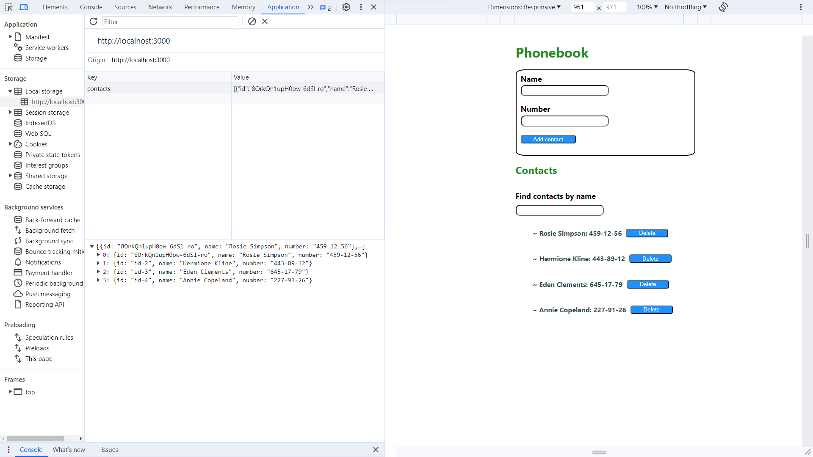

# My name is react project "Phonebook"
The project allows you to add and remove a contact list.

The aim of the project was to create an application that allows you to easily add a new contact to the phone book, as well as remove a given contact from it.

This application consolidates the material from the online course.
This project was created with
[Create React App] (https://github.com/facebook/create-react-app)

This application saves in localStorage.

This project is a continuation of task 3 "Phonebook", which used hooks.

## Technologies
- "JavaScript"
- "react": "^18.1.0",
- "nanoid": "^5.0.2",
- "node": "v18.16.1",
- "react-dom": "^18.1.0",

## Setup
- git clone - clone the remote repository to your computer locally;
- npm install - create dependencies;
- npm start - run the application, access to it will be at localhost:3000;